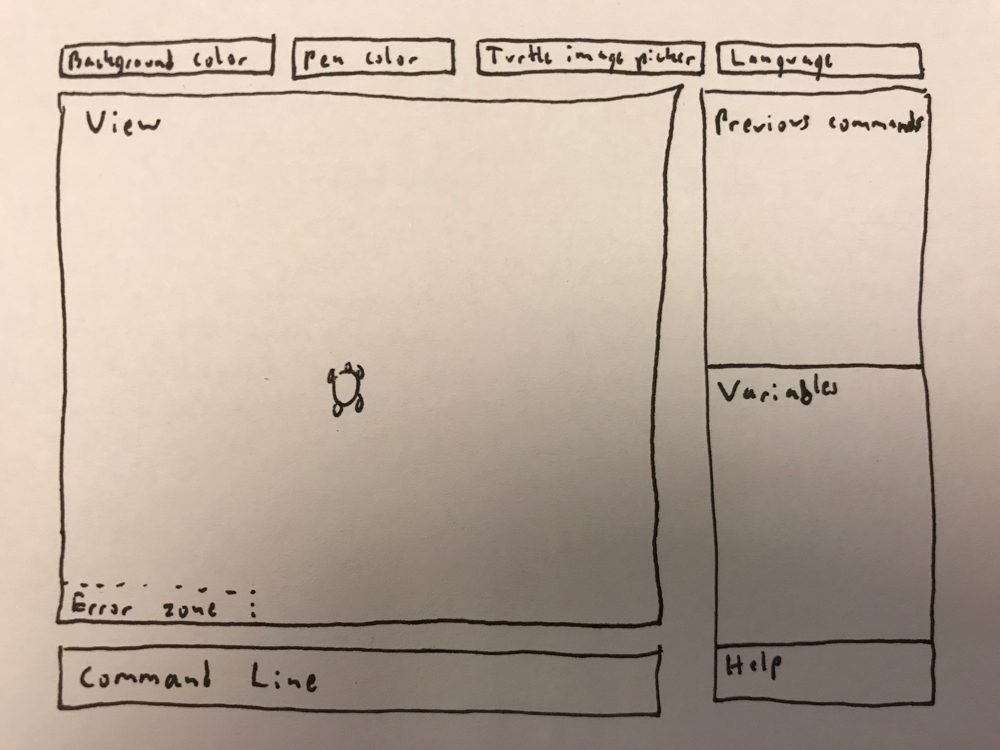
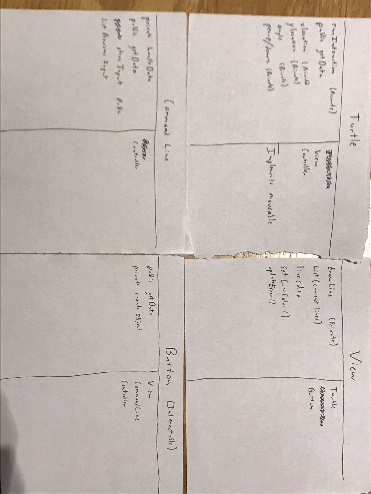
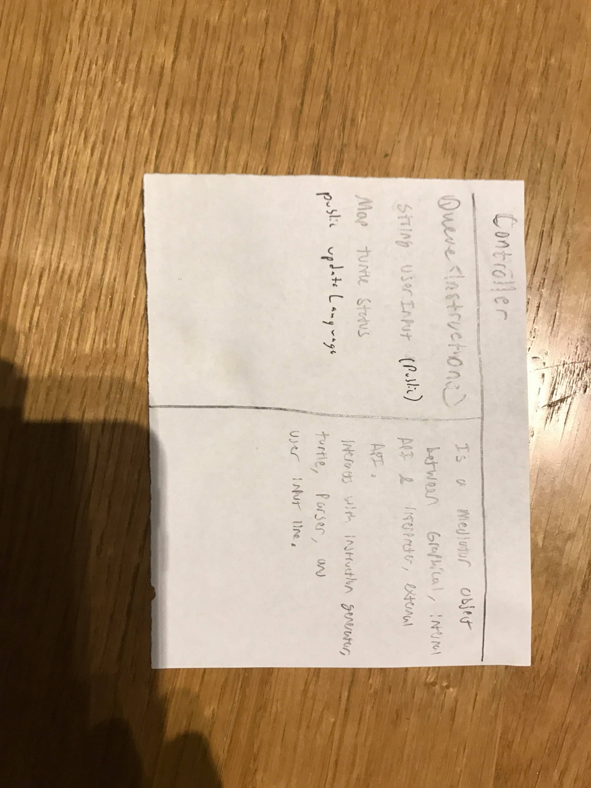
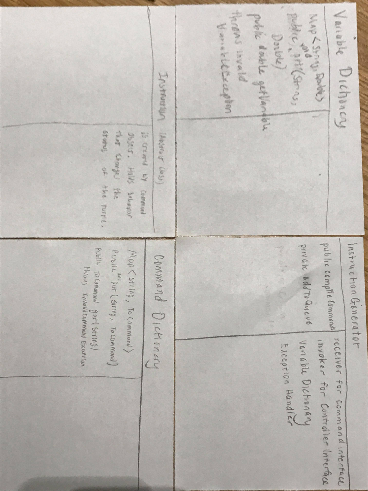
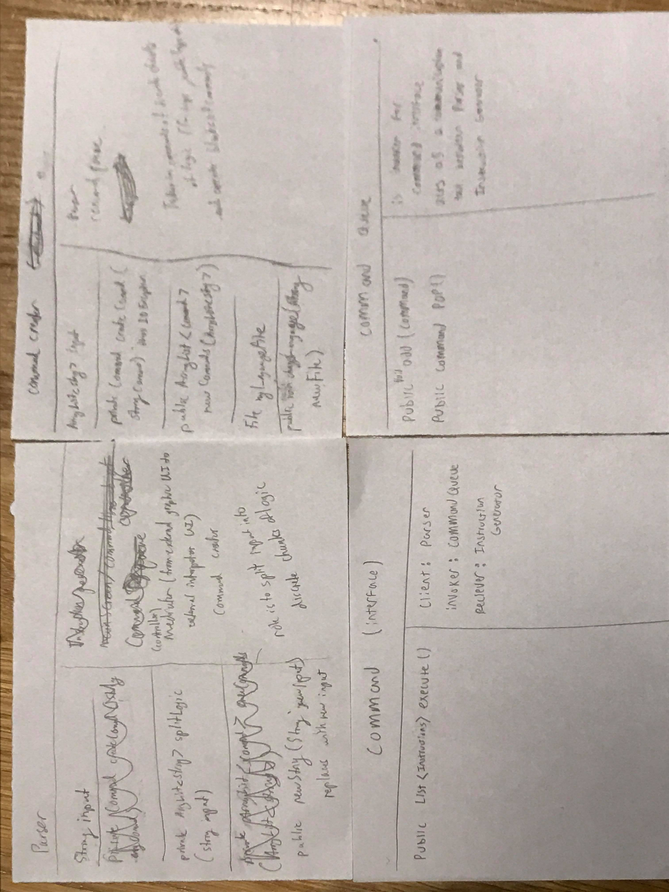

# slogo

CompSci 308 SLogo Design Plan

Team 1
* Brandon Dalla Rosa 
* Eric Fu
* Katherine Van Dyk 
* Martin Muenster 

### Introduction:
By writing this program, we are learning how to implement efficient and flexible API design within our code. Through this, we will be able to produce organized code that is easy for other users to use, understand, and extend.

Our primary design goal is to make a flexible program that supports the addition of new types of user commands, commands in varying languages/forms that can be parsed equivalently, and graphics that can be styled according to user input.  We want our program to be most flexible in the sense that new user features can be added easily with inheritance, by making interfaces and abstract classes wherever possible. Specifically, we plan to make interfaces for the turtle graphic to move and its pen to be drawn, and an interface to support the addition of new commands.
	
Our primary architecture includes four different APIs, an external and internal API for both the interpreter and for the graphical interface. At a high level, the user inputs a string into the command line, which is parsed by the command parser. Then, the command is stored within a command log, where commands are passed chronologically into the instruction generator. The instruction generator passes specific movement instructions back to the graphical interface (the turtle) where the instructions are executed.

### Design Overview:
#### Interpreter:
The external interface of the interpreter is responsible for handling communication between the graphical interface and the parser, and is also responsible for generating and storing instructions. It will perform communication handling through a mediator design pattern. There will be an interface named *Mediator* and a corresponding *Mediator* class, which both the graphical interface and the interpreter know. The Mediator will have methods that allow information, specifically the string input, to be passed from the graphical interface to the parser. The command creator creates a series of commands from the parser, which is passed into the command queue and therefore the instruction generator. On the other side of this API is instruction generation. This part of the API consists of an interface *Generatable* and a corresponding class
* command abstract superclass for math, boolean, movement, etc. commands
* inheritance: extend these subclasses for individual commands- store conditional + more commands or number.
* commands are held in the command log queue until they are processed.
* Instructions are generated from command objects within the instruction generator and are stored in a queue until they are sent to the turtle.

#### Graphical Interface:
The graphical interface encapsulates the frontend of the program and contains the following features:
* Main screen superclass, contains panels
* Turtle object implements two interfaces, one for use within the internal API (responsible for drawing itself and the lines) and one for use within the external API (responsible for receiving instructions for updating position/other parameters) to of the graphical interface.
* Panel superclass? Extended by drawing panel, command panel, settings panel

###  User Interface:
The user will be able to interact with the program by entering commands into the command line. Additionally, the user will be able to look at and access previous commands so that they can be altered to make new commands. An initially blank screen will be used to display the movement of the turtle. Once commands are input by the user, the turtle and the screen will update to show the changes desired by the user. If the commands are not valid, or there is a syntax/ spelling error of any sort, the screen will display the appropriate error message to inform the user. The error will be displayed in the bottom left corner of the view. On the top of the window, there will be pulldown menus to choose background and pen colors. Additionally, there will be a button to select an image file for the turtle, as well as a menu to choose the language of the program. On the right side of the window, there will be a box which displays the previous commands entered. Below this will be a box displaying all of the possible variables in the current environment. The very bottom right of the window will contain a help button to assist with descriptions about usable commands. If any data is chosen by the user which is invalid or does not exist, then the correct error statement will be shown to the user in the error region. A drawing of this setup can be seen below:

### API Details
#### UI External API
The UI external API is responsible for providing information from the UI to the interpreter and passing information from the interpreter to the UI. It receives the contents of the input from the Internal API. It then provides the input string to the interpreter and provides the current status of the turtle and the screen, based on the contents of the text input. This is mainly contained within the turtle class. From the interpreter external API, it receives the instructions from the instruction generator and will update the position, angle and other statuses of the turtle and of the screen. It also receives any exceptions that may have occurred, and will display the appropriate error message on the screen.

#### UI Internal API
The internal API of the UI is responsible for managing and handling the interactions between the various components and classes of the UI. The UI would include the many user-interactable components of the program, and this API would include methods dealing with the creation and handling of these components. Additionally, this API will focus on correctly and efficiently placing the data provided by the user into forms which can be given to other parts of the program through the external API. Another aspect of this UI would be to correctly format the data provided by the program and display it into an easy to understand format. It should manage the location and placement of all visible components at all times, allowing for them to be easily and efficiently edited, added, or removed. This API will contain methods which deal with the components of the program that deal with javafx, since javafx is mainly used to provide visuals to the program. This API will function even if the program is extended, since the general methods for creating and managing javafx objects does not change based on the complexity of tasks completed by the program.

This API will include the turtle class, and update it based on information obtained from the interpreter external API. It will also contain a command line class which will read in the user-provided strings to be interpreted. This class will have methods to monitor the state of the command line and to provide the data to the external UI API depending on the state. Additionally, there will be methods in the internal UI API which will be able to transfer data in between the components of the UI, such as previous commands from the visible list being given to the command line for reuse. Some exceptions that may be thrown in this API deal with reading in nonexistent or badly formatted files that contain data for the UI setup. There also will be an interactable button class which will generalize the GUI components which deal with common user input. This will handle the ability to change the pen color or language of the parser.

Some methods included with this API are the setLineColor() which sets the current line color in the view, storeInput() which stores all user input commands, and getData() which returns the values chosen by the user in the UI.
	

#### Interpreter External API
The external API of the interpreter is responsible for handling and processing communication between the graphical interface and the internal interpreter API. A string representing the user input and the status of the previous action are passed in and passed forward to the internal interpreter. A mediator class, *Controller*, will be created here for this purpose. The internal interpreter returns a Command object and throws any exceptions back to the external interpreter. Here, the exceptions are handled, and an error message is passed back into the graphical interface to be displayed. The InstructionGenerator will get valid commands from the CommandQueue. The command object is processed within the instruction generator, by calling the *execute* method of the command. The InstructionGenerator returns a list of instructions to the Controller. Furthermore, this API is responsible for getting and setting custom variables and custom commands. It will perform this through using a VariableDictionary object and a CommandDictionary object.

#### Interpreter Internal API
The interpreter internal API handles parsing and returning a list of commands to be passed to the External Interpreter API, and then to the Frontend Internal API. The Internal API supports all commands listed in the assignment specification, including boolean, math, movement, and other commands. The Internal API also fulfills the requirement that commands are parsed on an per-expression basis, as it parses a string of user input into multiple commands if necessary. Finally, the backend passes error messages to the External Interpreter API and stores outgoing commands in a queue object.

The Internal API contains an command interface, which is extended each type of command into another abstract class (e.g. math commands, boolean commands, etc) and then further by each specific command (e.g. add command).  This supports the addition of new types of commands, and even new commands within existing categories. A parser class also exists, and will take in a user input string passed from the Interpreter External API. This passes several strings, split into logic chunks into the commandCreator class, command queue series of command objects. The creator calls a createCommand method which instantiates a certain command object based on the string. The queue containing both the parsed command objects, and a separate queue holding all input strings pre-parsing are both held in a controller class for the backend. The controller class takes in all input strings and pops items from the queue from/to the mediator class between the external/internal API’s. The parser will pass command exceptions through the controller class to the mediator class between the two API’s. The design of this API allows for the creation of new command types, and allows for flexibility in error handling, as the frontend can handle any error as it chooses.

### API Example Code
#### General
##### User types ‘fd 50’ into command line
The “Command Line” object realizes that an action event has occurred. It adds the string into the list of previous inputs. The “Command Line” object then calls updateInput() on the “Controller” object and updates the current input string. Then “Controller” object then calls newString() on the parser and provides it with the desired input string. The parser receives the input string and calls splitLogic into it, but this doesn’t alter the string. Then the CommandCreator calls newCommands, which calls createCommand once, returning a new Command object. This new object is a MoveCommand with a parameter of 50 and adds it into the command queue. When the instruction generator is available, it will pop a command from the command queue and feed it  into its own “compileCommand”

#### UI External API
##### User changes the desired language setting to Chinese.
The “Interactable” object would realize an action has occurred. The updateLanguage() function on the controller would be called, updating the current program language. Then the controller would updateLanguage() on the parser, changing the valid library to the desired Chinese.
#### UI Internal API
##### User chooses a new color of line for the turtle in the dropdown menu
The “Interactable” object would realize an action occurred. It would then pass the value of the desired color to the current “View” class in setLineColor(). The view class would then set the color as its active color, and whenever the turtle was moved next with pen-down, the line would be the desired color.
#### Interpreter External API
##### Command object throws invalidCommandException()
Command object encounters invalid formatted command and calls the ExceptionHandler's invalidCommandException() method. ExceptionHandler passes this command to the Controller's newException() class as a string message, the Controller passes the same string to the View's updateError(String), which updates the error 'console' to display the specific error message string.

#### Interpreter Internal API
##### Parser receives user input: DOTIMES[3][fd 50]
The Parser calls userInput of the controller to obtain a string representation of the command. It then calls its own splitLogic() method and passes it into the command creator. The command creator calls newCommands() which returns a list of Command objects by iterating through the the arrayList passed and calling createCommand on each string. createCommand will access the Language file stored in order to determine which command objects to create. The newCommand method will create a DoTimesCommand (which stores an array list of commands and a parameter for the number of times nested commands should be created), and 3 MoveCommands with a parameter of 50. These MoveCommands will be stored within a list of the DoTimesCommand, and the newCommand method will add this single command into the CommandQueue.

##### CommandCreator recieves an invalid input.
The command creator calls newCommands which calls createCommand on each individual string. When the string passed in doesn’t match any of the required formats, it will throw an IOException that will be handled by the external api- the corresponding error message will be passed to the UI and displayed.

### Design Considerations
#### Command and Instruction Generator Objects
We need to figure out how specifically the command objects and the instruction generator will interact, specifically in commands that create new variables or commands. One solution is to allow the command to access the dictionaries so that they can directly edit the keys and values within it. The downside to this method is that the command object will have too much responsibility and information. The other discussed solution is to have the InstructionGenerator manage the use of custom variables and commands by having the Command object pass a special instruction, telling what the instruction generator should perform. The downside to this method is that instructions are meant for the turtle, not for the InstructionGenerator. Furthermore, with nested commands that both set and use variables, it may be impossible to set a variable in the dictionary before getting that value.

Design decisions discussed at length:
What exactly is the difference between an instruction and a command? We decided that command objects were to be created from the user input, and these go to the instruction generator, which provide direct input to the turtle and to the screen to change its state. We thought about bypassing the command objects, but this led to instructions being created directly from the user input, giving too much responsibility to one class. 
#### Turtle Object
One design decision that was discussed was where to store the Turtle object, and how much/what information the turtle had access to. The turtle could either consist of a backend and frontend component both located in the Internal Graphical API and the External Interpreter API, respectively, or simply consist a frontend component. However, we decided that this would make the turtle object too robust- the turtle was primarily a display component that changed positions- it shouldn’t also be responsible for parsing and passing information to its frontend. Therefore, we decided to make the turtle a strictly frontend component that takes in position statements and simply converts them to changes in coordinates based on its current position (and updates its display accordingly). 
#### Assumptions and Dependencies
All classes are necessary for the program to function. The UI classes and the interpreter classes are all dependent on the “Controller” class and the data held within, as all communication between the two are monitored by the controller.
### Team Responsibilities
#### Brandon
Primary responsibilities include the creation of the UI external and UI internal API, as well as the user interactions. Secondary responsibilities include working on interactions with the controller.
#### Katie
Primary responsibility includes implementing instruction generator, including handling exceptions, and aspects of the controller class dealing with passing information to the External Graphical API. Also developing Variable Maps and parser.
#### Eric
Responsible for the process of creating commands, starting from receiving them from the UI to the parser and then passing it to the command creator, which gives it to the command queue.
#### Martin
Responsible for creating a Command interface and for managing the command design pattern that will be used in the interpreter. Also in charge of implementing *execute* for many commands..

